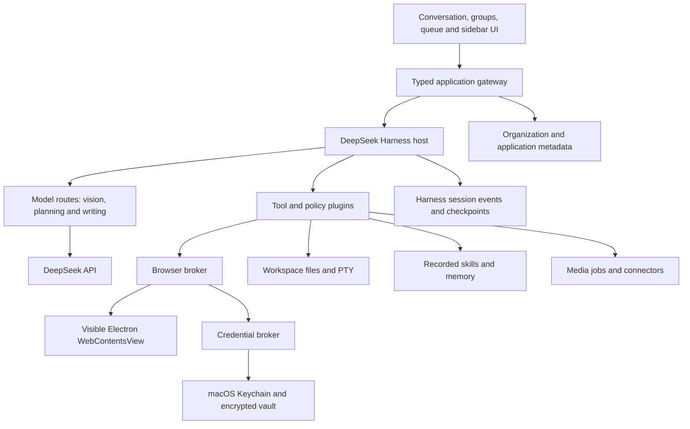

# Agent OS — macOS application build plan

Planning date: 17 September 2026. Status: implementation in progress; a working local Electron build exists. See AGENT_OS_README.md for verified coverage and remaining release tracks.

Build a local-first Electron application in which a person can describe a task or demonstrate a workflow, then watch a DeepSeek-powered agent carry it out in the same browser, file viewer, and terminal shown beside the conversation. Use DeepSeek Harness as the actual execution runtime. Add a password manager, editable `soul.md` memory, reusable recorded skills, nested chat organization, and the queue controls shown in the user's reference screenshot.

## 1. Product decisions and scope

| Decision | Planned behavior |
|---|---|
| Application | Agent OS, a macOS Electron desktop app with its own identity and familiar Codex interaction patterns. |
| Runtime | Extend a pinned DeepSeek Harness source distribution; preserve its agent loop, event log, plugin architecture, and existing session APIs. |
| Accounts | Personal, single-user application initially; user supplies a DeepSeek API key through the secure settings UI. |
| Storage | Local on the Mac by default. Model calls send selected task context to the configured provider; local storage does not mean offline inference. |
| Primary workflow | Prompt or record → understand → execute → observe → verify → deliver evidence. |
| Browser | A real embedded Chromium browsing surface controlled by the agent and the user, with persistent account profiles. |
| Recording | Browser action recording first. Include native Mac demonstrations and imported screen recordings as later delivery phases within the full plan. |
| Media | Local editing/rendering first; add generation, transcription, and voice providers behind explicit capability interfaces. |
| Organization | Nested sidebar groups and subgroups containing chats, plus project workspaces, pins, archive, search, and drag-and-drop. “Group” means organization, not a multi-person messaging service. |
| Autonomy | Task instructions and saved grants authorize work. Avoid repeated prompts for already authorized actions; require clarification only for missing authority or an unresolved consequential choice. |
| Delivery | Signed and notarized macOS application, installation package, update channel, recovery tools, and end-to-end test evidence. |

Unanswered product questions are assumptions, not blockers to planning: browser demonstrations are the first recording mode, video editing comes before generated clips, and the first release runs on the user's Mac. Credentials, production account access, distribution signing, and any optional media-provider access are supplied during implementation when needed.

“Everything Codex has” needs a tracked inventory. This plan covers the requested local workflows and the relevant desktop surfaces. It cannot reproduce OpenAI's private implementation, hosted infrastructure, proprietary models, or account entitlements. Cloud execution, remote access, team collaboration, and a public plugin marketplace have separate delivery tracks below; they must not appear as working features before their services exist.

## 2. Findings that determine the architecture

### DeepSeek models

The official API currently identifies V4.1 Flash as `deepseek-flash`. It supports vision, tool calls, and thinking/non-thinking modes. The requested `deepseek-v4-flash-vision-exp` identifier remains accepted, but the original model has been retired and requests are served by V4.1 Flash. This means two configured roles need not represent two distinct underlying models. [DeepSeek models documentation](https://api-docs.deepseek.com/quick_start/pricing/)

Planned model configuration:

| Role | Requested API identifier | Use |
|---|---|---|
| Vision | `deepseek-v4-flash-vision-exp` | Preserve the user's requested identifier while supported; inspect screenshots, visible controls, and rendered results. Show the documented V4.1 routing in settings. |
| Planning and execution | `deepseek-flash` | V4.1 Flash for task interpretation, tool selection, recovery, and multistep reasoning. |
| Writing | `deepseek-flash` | Drafting posts, replies, documents, and scripts; non-thinking mode where appropriate. |

Before accepting settings, run a text request, an image-understanding request, a tool-call round trip, streaming, and cancellation probes. Record the requested model, returned model metadata, provider, and timestamp. An alias is not a guarantee of a frozen model version. Do not silently change models when a configured route disappears. Exact API parameters and version behavior must be checked against the pinned adapter during implementation.

### Harness reuse and gaps

The evaluated upstream desktop manifest reports `0.1.6-alpha.2`. Treat this as an evaluated candidate, not a production-qualified release. Harness describes itself as a developer preview, so upgrades require compatibility testing. [Repository](https://github.com/deepseek-ai/deepseek-harness)

The inspected source already supplies an Electron application, sessions, streaming, durable queue management, skills, tools, policies, sidebar files/terminal/previews, and extension points. Extend those components instead of embedding an unrelated agent backend. [Desktop source](apps/desktop/README.md)

Three gaps are especially important:

1. The sidebar browser currently uses an iframe, and it does not register model-facing browser tools. It is not the shared, agent-controlled browsing surface required here. Replace the desktop carrier and connect tools to its exact target. [Sidebar browser source](packages/client/ui-sidebar-browser/README.md)
2. Browser-use providers are separate experimental integrations. Their shared registration service does not define a universal browser API, and launched session profiles are not restored from the chat log. Build one Agent OS browser provider with explicit profile and tab ownership. [Browser-use source](docs/subsystems/browser-use.md)
3. The default local credential provider stores values in an owner-readable YAML file. Replace that provider for this application; it is not the password vault requested by the user. [Credential implementation](packages/credentials/credentials-local/src/index.ts)

The published architecture page and the inspected desktop source disagree about transport details: the page describes pipes without a web listener, while the current source uses an authenticated local host and packaged application origin. The pinned source and a runtime inspection must settle the integration. Do not design against an assumed IPC API. [Architecture documentation](https://deepseek-harness.github.io/deepseek-harness/en/reference/)

The reference behavior is a shared browser inside a task with a separate browser profile. This plan implements that interaction in Agent OS rather than assuming Codex's internal browser implementation is public. [Official browser documentation](https://learn.chatgpt.com/codex/browser)

## 3. Complete user experience

### Window layout

```text
┌────────────────────────────────────────────────────────────────────────────┐
│ Agent OS       back / forward              task title             controls │
├──────────────────┬──────────────────────────────┬──────────────────────────┤
│ New chat         │ Conversation                 │ Browser | Files | Terminal│
│ Search           │                              │                          │
│ Scheduled        │ User request                 │ The actual page the      │
│ Skills           │ Plan / progress              │ agent is operating       │
│ Connections      │ Tool actions and results     │                          │
│ Vault            │ Output artifacts             │ Address bar, tabs,       │
│ Memory           │                              │ navigation, takeover     │
│                  │                              │                          │
│ Pinned           │                              │ Or editor / diff / PDF / │
│ Work             │                              │ media / live terminal    │
│  Marketing       │                              │                          │
│   LinkedIn       │                              │                          │
│    Campaign chat │                              │                          │
│ Projects         │ Queued: request A  Steer ⋯ × │                          │
│  agent-os        │ Queued: request B  Steer ⋯ × │                          │
│   Implementation │ Composer + files + send/stop │                          │
└──────────────────┴──────────────────────────────┴──────────────────────────┘
```

Resizable and collapsible panes; system/light/dark themes; keyboard navigation; accessible labels; native macOS window controls. Match the screenshot's navigation hierarchy, selected-row treatment, queue placement, compact action buttons, and anchored composer. Use a distinct application identity.

### Onboarding

1. Pick a working folder or create a personal workspace.
2. Add the API key in secure settings and validate model capabilities.
3. Create the local vault and explain where account profiles and task history live.
4. Choose **Describe a task**, **Record a skill**, or **Use a saved skill**.
5. Ask for microphone, Screen Recording, or Accessibility permission only when the selected feature needs it. Embedded browser observation should work without whole-screen recording permission.
6. Sign in to websites directly in an account profile, or connect a supported API account through its normal authorization flow.

### Prompt-driven work

The agent interprets the request, selects relevant skill and memory context, opens the required sidebar surface, performs small actions, checks their outcomes, and produces links or files as evidence. It can ask for missing facts while continuing independent work. The user can pause, stop, take over a page, or steer the task without opening another application.

Show concise progress and action explanations, the selected account, destinations, changed files, and redacted tool results. The product must not depend on displaying raw model reasoning to explain its work.

### Demonstration-driven work

**Record skill → select page or app → demonstrate → stop → review inferred steps and variables → test → save.** A prompt-only task can also offer **Save as skill** after successful execution. One demonstration creates a candidate procedure; validation determines whether it is reusable.

## 4. Chat groups, subgroups, and project management

This is a first-class requirement from the user's screenshot, not a later cosmetic enhancement.

| Capability | Required behavior |
|---|---|
| Groups | Create, rename, nest, collapse, expand, reorder, archive, and delete groups. Support arbitrary stored depth; keep deep hierarchies readable with breadcrumbs. |
| Chats | Create, rename, move, duplicate, fork, pin, archive, restore, export, and delete. Show running, queued, waiting, completed, failed, and unread states. |
| Drag and drop | Move individual or selected chats and subgroups; show the destination and disallow cycles. Persist order transactionally. |
| Group deletion | Default to ungrouping children, retaining chats. Deleting contained chats is a separately labeled destructive action. |
| Projects | Bind a project to a filesystem workspace, optional Git repository, project memory, default skills, and account choices. |
| Organizational moves | Moving a sidebar row changes its placement. It must not silently change a running chat's folder, repository, account, or permissions. Moving work to another project uses a distinct operation. |
| Pins | A shortcut to the same chat or project, never a duplicated conversation. |
| Search | Global search across titles and content, with group/project/status filters. Search never starts a dormant agent. |
| Bulk actions | Move, archive, restore, and delete selected chats; show counts and retain recoverable trash where applicable. |
| Persistence | Reopen the app with the same organization, selected task, collapsed groups, drafts, and queue state. |

A group is an organizational container. It does not automatically mix all child conversations into model context. Project context is explicitly selected. Future shared/team groups require access control and synchronization and are not implied by this local hierarchy.

## 5. Queue, steer, edit, and delete semantics

Reuse Harness's session controller and durable inbox projection. It already exposes queue editing, removal, steering, request-ID deduplication, and completed-turn forks. Add missing presentation, ordering, or attachment operations through the same backend ownership. Do not maintain an independent renderer-only queue. [Session controller source](packages/api/session-controller/README.md)

| Situation/action | Exact behavior |
|---|---|
| Send while idle | Start a turn immediately after durable admission. |
| Send while running | Queue for the next turn by default; visibly acknowledge the queued message. |
| Queue dock | Ordered rows above the composer with message preview, attachments, position, Steer, Edit, Delete, and drag handle/menu. |
| Steer | Atomically move that message from the normal queue into the active task's steering inbox. Consume at the next safe model/tool boundary; show pending and applied states. Never execute it again as a later queued turn. |
| Edit a queued message | Edit text and supported attachments in place. Saving compares the expected revision; a message already claimed by the worker cannot be edited as pending. |
| Delete a queued message | Remove it before claim, release unused attachment references, and offer a short undo action. No model call occurs. |
| Reorder | Reorder only pending items in one transaction. An active/claimed message stays fixed. |
| Cancel an edit | Restore the saved queued item and preserve any other composer draft. |
| Pause | Stop admitting additional actions after the current safe boundary; retain the run and queue. |
| Stop | Cancel active model work and cancellable tools; mark the run stopped. Preserve pending messages and do not auto-start them until the user resumes or sends again. |
| Take over | Revoke the agent's browser input lease immediately and give the user control. Fresh observation is required before the agent resumes. |
| Edit a sent message | Create a revised branch from before that message and rerun from the revised input; keep the original branch accessible. Do not rewrite already performed external actions. |
| Delete a sent message | Remove it from the current conversation branch and future context, with a revision marker. Show that external effects remain. Permanent content deletion follows the retention/purge path, including attachments and search indexes. |
| Retry a failed turn | Retry from a known checkpoint after reconciling external effects; not a blind repeat of all actions. |

A steer request cannot reverse a click already sent to a website. During an irreversible action, show **Steering pending; current action is settling**. Provide a separate explicit stop-and-replan control where cancellation is possible. Do not label steering “applied” before the new instruction reaches the agent.

Concurrency rules: one worker claims each inbox item; revision-checked edit/remove/steer; one active input owner per browser target; no dispatch of stale planned actions after a newer steering revision is accepted. Native desktop control requires an exclusive desktop lease across all local runs. Parallel work remains possible across independent workspaces and browser profiles.

## 6. System architecture and ownership



### Recommended foundation

Maintain an Agent OS distribution of the pinned Harness repository, with product additions primarily as Cordis plugins and a small, tracked set of Electron shell changes. Retain upstream package boundaries and UI slot mechanisms. Start by building the existing distribution unchanged, then add one capability at a time. Avoid a deep rewrite of Harness internals.

Use its existing React/TypeScript renderer and release tooling. Use SQLite for Agent OS metadata that Harness does not already own. Preserve Harness event persistence as the source of truth for conversations, turns, tools, and its inbox. A derived index is rebuildable; it is not another authoritative copy of messages.

### Processes

| Boundary | Responsibility |
|---|---|
| Electron main | Window/view lifecycle, trusted IPC, account browser partitions, OS dialogs, permissions, update coordination. |
| Application renderer | UI and typed commands only. No API keys, raw filesystem, Node integration, unrestricted shell, or general credential decryption. |
| Harness host | Task loop, model calls, sessions, tool registration, policy decisions, skills, workflow events. |
| Credential broker | Separate trusted component for Keychain access, unlock state, API authorization, and destination-bound autofill. |
| Worker processes | PTYs, rendering, transcription, document conversion, and other long or crash-prone jobs. |
| Remote page renderers | Untrusted website content with Chromium isolation and no application bridge. |

Keep the inspected authenticated host transport initially if it passes the source/runtime audit. Bind only to loopback, validate origin and session credentials, and ensure visited pages cannot authenticate to it. Use narrow main-process IPC for browser and vault operations. Expose no generic `execute arbitrary code` IPC method to web content. If the upstream transport changes, qualify the entire version before adopting it.

### Proposed additions

```text
apps/desktop/                         existing shell; Agent OS adaptations
packages/agentos/organization/        groups, subgroup tree, pins and search
packages/agentos/chat-controls/       queue dock and revision/branch UX
packages/agentos/browser-provider/    tools controlling owned visible targets
packages/agentos/browser-shell/       sidebar carrier and profile management
packages/agentos/recorder/            event capture and demonstration review
packages/agentos/skill-compiler/      recordings to versioned procedures
packages/agentos/memory/              soul.md and project memory
packages/agentos/vault/               encrypted credential provider
packages/agentos/workflow-state/      checkpoints and external-effect ledger
packages/agentos/connectors/          optional mail/social/provider adapters
packages/agentos/media/               editing and generation job adapters
packages/agentos/git/                 worktrees, changes and review surfaces
packages/agentos/desktop-control/     native Mac observation/input integration
tests/agentos/                        fixtures, workflows and release checks
```

These are planned package names, not claims that upstream exports them.

## 7. The shared sidebar browser

Use Electron `WebContentsView` for real third-party pages. It lets the main process own and present a `WebContents`; do not put production browsing behind an iframe or disable website protections to make embedding work. [Electron WebContentsView](https://www.electronjs.org/docs/latest/api/web-contents-view)

The first technical proof must demonstrate that the user-visible tab, screenshots, observations, input actions, and recorded events all reference the same owned browser target.

Implementation requirements:

- Map `chatId + tabId` to an owned `webContentsId` and account profile. The model receives opaque IDs, not arbitrary access to all open tabs.
- Bind browser operations through a restricted broker using Electron input APIs and target-specific CDP where needed. Do not expose a public remote-debugging port or attach to the user's ordinary Chrome profile by default.
- Capture visible screenshots and semantic page observations, including relevant accessibility/DOM information. Use semantic targets where available and vision for visual interpretation or difficult controls. Re-observe after navigation, major layout changes, and important actions.
- Carry observation revision, target origin, frame identity, and viewport size with action requests. Reject stale or cross-target actions. Account for Retina scaling, zoom, scrolling, iframes, and shadow DOM.
- Keep the view correctly positioned on resize, pane collapse, tab switching, modals, menus, and native full screen. Native view stacking must not cover queue controls or credential dialogs.
- Persist cookies and session storage in named Chromium partitions. Profiles are separate from the system browser and from other Agent OS accounts. Chats receive explicit profile access and concurrency leases.
- Support navigation history, back/forward/reload, multiple tabs, popup ownership, uploads, downloads, and file selection. Use the approved file paths, not unrestricted directory access.
- Keep downloads in the selected workspace or download directory and show completed artifacts in the file pane. Do not auto-open executable downloads.
- Preserve TLS validation, Chromium site isolation, context isolation, sandboxing, and origin checks. Deny unexpected application schemes and navigation into the trusted app origin.
- On renderer crash or app restart, restore tab metadata and account storage, then re-observe. Live DOM handles and an in-flight browser action are not recoverable by replaying a chat log.

Some identity providers disallow embedded sign-in, and some sites challenge automation. Validate Gmail, LinkedIn, Instagram, and target job sites early. Where necessary, complete authorization in the system browser and use a proper connector in the sidebar. Keep that limitation visible; do not promise that every website will always allow an embedded login. MFA and CAPTCHA use human takeover, then resume from observed state.

## 8. Recorded skills and skill execution

### Capture

Record navigation, click targets, selected controls, safe input values, key actions, scroll landmarks, uploads by workspace reference, visible screenshots at meaningful steps, and optional narration. Use monotonic timestamps and explicit start/pause/resume/stop markers. Recording starts only on selected surfaces.

Password/OTP fields and configured private regions must be masked before storage or model upload. Replace credentials with vault references. Handle custom login controls and text fields containing secrets; relying only on `type=password` is insufficient. Skip or mask uninspectable cross-origin credential regions rather than recording them blindly.

Browser event recording is the first reliable mode. Native Mac recording uses scoped screen capture, accessibility observations, and explicit capture permission. Imported videos supply visual evidence without DOM events; mark uncertain steps and ask for missing targets/variables during validation. Spoken narration requires a transcription component; do not assume the DeepSeek text/vision route supplies speech recognition.

### Compile

Create a skill package containing:

```text
skills/<skill-id>/
  SKILL.md             readable objective, instructions and limits
  workflow.json        typed inputs, steps, checks and recovery branches
  examples/            scrubbed example values
  evidence/            selected redacted frames
  evaluations.json     validation history and supported variations
```

Distinguish demonstration facts from inferred intent. A useful procedure contains a goal, prerequisites, supported domains/apps, account roles, input schema, semantic actions, expected states, conditional branches, recovery steps, completion evidence, and required authority. Raw coordinates can be evidence, but not the primary durable workflow representation.

Example: “Post an update to LinkedIn” takes `account`, `postText`, `media`, and `publicationMode`; it checks the account and composer, attaches assets, reviews the preview, publishes only within the user's authorization, then records the published URL. The demo's specific draft text is an example, not a value to repeat forever.

### Review and reuse

The review screen shows the recording beside the generated steps, variable fields, ambiguous actions, and sensitive-data masks. The user can edit steps, split or merge them, set defaults, and test on a safe fixture or draft. Register approved packages through Harness's skill provider. [Skill subsystem](docs/subsystems/skills.md)

Version skills immutably. Each run pins the version and records deviations. Repeated failures suggest a revision, never silently change all future runs. Sharing/export excludes secrets, account sessions, and unrelated recording frames.

## 9. Password manager and account sessions

Build an application-scoped password manager with entries, folders/tags, search, account labels, password generation, add/edit/delete, secure reveal/copy, and destination-bound autofill. Store DeepSeek keys and connector refresh tokens through the same protected credential infrastructure, using distinct access policies.

Use established cryptographic libraries and macOS Keychain. A local encrypted vault uses authenticated encryption and a random key protected by Keychain. Electron's safeStorage can provide OS-backed string encryption, but does not by itself define a complete vault, Touch ID policy, session lock, or recovery system. [Electron safeStorage](https://www.electronjs.org/docs/latest/api/safe-storage)

Design requirements:

- The agent sees entry IDs, account labels, and permitted origins; it has no general `getPassword` tool.
- Autofill takes an opaque credential reference, approved origin/frame, target field, and expiring operation grant. Recheck the actual destination immediately before insertion, including redirects and frame changes.
- Passwords never enter prompts, tool arguments/results, `soul.md`, skill recordings, logs, ordinary SQLite text columns, or screenshots sent to models. Redact at the collection boundary, not only when rendering the UI.
- Use a trusted unlock/reveal surface. Touch ID-backed key access, if enabled, is enforced by Keychain access control through a native bridge, not merely a renderer boolean.
- Auto-lock on user request, inactivity, and appropriate OS lock events; clear copied passwords after a configurable interval if the clipboard still contains the copied value.
- Treat authenticated browser cookies as separate sensitive account state. Locking the password vault does not log the user out of websites. Offer separate browser-session lock/clear controls.
- Keep the vault and application control credentials inaccessible to ordinary agent shell jobs. A full-access local process weakens isolation; do not claim protection against a fully compromised host or arbitrary privileged code.
- Implement encrypted backup/export and restore with a separately supplied recovery passphrase and a vetted password KDF. State that losing both device access and recovery material makes the vault unrecoverable.
- Import plaintext password CSVs only through a deliberate local flow, never upload them for analysis, and do not claim guaranteed secure erasure from SSDs.

The trusted application host necessarily handles provider authorization. Isolate that path from agent-authored scripts and untrusted plugins. Bundled, audited tools run in the trusted host; external plugins require an explicit trust decision or an isolated process with restricted capabilities.

## 10. soul.md and memory

Store `soul.md` as readable, user-editable Markdown, with a Memory screen, version history, and “forget” controls. It contains identity, preferences, writing style, goals, recurring workflows, important decisions, and links to relevant profile documents. Store factual résumé information in a dedicated profile file so job applications can cite its source.

Separate global memory, project memory, reusable skills, and temporary run state. Groups alone do not grant new context access. The context builder selects relevant material with source labels and a bounded token budget; it does not paste the user's entire private history into every request.

Explicit “remember this” instructions can update memory directly. Inferred long-term facts appear as reviewable suggestions unless the user enables automatic learning for that category. Preserve attribution, date, and revision; reject conflicting updates rather than silently overwriting facts.

No passwords, keys, cookies, OTPs, or private authorization grants in `soul.md`. Website text and email content cannot directly rewrite memory or become higher-priority instructions. Deleting memory also removes derived search/index entries. File access permissions and task authority are enforced by the runtime, never by treating Markdown as an access-control system.

## 11. Agent execution, policy, and recovery

Use the Harness loop as the coordinator. Each action cycle selects the next step, obtains fresh relevant state, checks authority, executes through a typed tool, verifies the result, and records a checkpoint. Vision reports observations; the planning route chooses actions. Both are grounded in the same current browser/native target.

Represent run states explicitly: `queued`, `planning`, `running`, `waiting_for_user`, `paused`, `recovering`, `completed`, `failed`, `cancelled`. Persist checkpoints with session/turn IDs, skill version, target IDs, current input revision, expected result, and evidence references. Do not store raw credentials in checkpoints.

Separate safe retries from external effects. Reads can retry with bounded backoff; a submitted post, mail send, or application cannot be replayed merely because the response was lost. Maintain an external-effect ledger with attempt ID, destination, content digest, authorization reference, status, and receipt. Use provider idempotency keys where available. With browser-only actions, reconcile page state and receipts; if the result remains uncertain, report that uncertainty instead of submitting again. Universal exactly-once delivery is not possible across arbitrary websites.

Support three understandable modes:

| Mode | Behavior |
|---|---|
| Plan | Inspect relevant sources and produce a proposed procedure; do not perform external mutations. |
| Assisted | Perform authorized work; request missing information or action authority only when necessary. |
| Delegated | Run within saved, bounded grants covering accounts, destinations, workflows, and limits; request input on exceptions. |

Permission checks run in code at execution time. They include file scope, browser origin/account, tool capability, and external-effect authority. Treat pages, emails, downloaded documents, and plugin outputs as untrusted task data. Never let a page's instruction authorize terminal execution, vault access, memory edits, or a new external destination.

Offer per-task time, step, token, and estimated-spend limits; repeated-action detection; cancellation; and context compaction. Record real usage from all model routes and media providers. Show estimates as estimates and refresh pricing separately from model identity.

## 12. Requested workflows and completion evidence

| Workflow | End-to-end implementation | Evidence of completion |
|---|---|---|
| Open websites | Prompt opens an owned sidebar tab, reads relevant content, navigates, and summarizes or acts. | Actual target URL and observed result. |
| Fill forms | Map supplied facts to fields, validate required values, attach selected files, handle conditional fields, submit within authority. | Confirmation screen/receipt; no invented missing answers. |
| LinkedIn posting | Select account, draft text, preview assets, fill composer, publish or schedule via supported method. | Published post URL/ID or clearly labeled saved draft. |
| Instagram posting | Prepare supported image/video format, caption and preview; upload through available browser/API route. | Published permalink/ID and media preview. |
| Job applications | Use verified résumé/profile, match requirements, draft tailored materials, fill fields, upload files, review unfamiliar questions, submit. | Employer/role, files used, application status and receipt. |
| Mail reading | Open webmail in the sidebar, or a native mail pane backed by a connector; read selected threads and attachments. | Source-linked summary with account and message IDs. |
| Mail drafting/sending | Draft in context and show recipients, subject, and attachments; send when explicitly authorized. | Draft ID or sent-message confirmation. |
| Video editing | Import footage, infer a proposed edit, build an editable timeline, cut/crop/caption, mix supported audio, export. | Playable video, project file, output properties, and sampled frame/audio checks. |
| Generated media | Obtain assets from a configured generation provider, track job progress, then integrate with the edit. | Real returned media files and provider job status. |
| File work | Read, create, edit, preview, compare and export supported local files. | Saved artifact with accessible preview and location. |
| Terminal work | Run commands in the selected workspace, stream output, preserve PTY sessions, stop jobs, open localhost previews. | Exit status, relevant output, and produced files. |

DeepSeek supplies the planning, text, code, and visual interpretation here. This plan does not assume that the named DeepSeek routes generate video/audio. Use a local media pipeline for editing; generated clips, image assets, transcription, and voices need separately verified components. FFmpeg-based rendering and a small editable timeline are the default implementation direction. Select exact packages and distribution-compatible binaries during the media spike.

For each external platform, maintain a support matrix of tested account types, login methods, actions, upload formats, and known blockers. Begin with browser execution to match the requested experience; add official connectors when they improve supported workflows. Connector actions remain visible in the timeline rather than pretending a website click occurred.

## 13. Data and persistence model

Use a dedicated Agent OS application-data directory and a separate Harness home within it. Do not share executable profiles or secrets with an existing user installation of DeepSeek Harness.

| Entity | Key fields/ownership |
|---|---|
| Project | ID, workspace path, Git metadata, defaults, memory references. Agent OS owns metadata; files remain in the chosen workspace. |
| SidebarNode | ID, parent ID, kind, target ID, sort rank, collapsed state, revision. Cycles rejected; one canonical chat placement plus optional pin shortcuts. |
| Chat/Session | Harness session ID plus project linkage and application metadata. Harness owns messages, turns, and inbox events. |
| Message revision | Original identity, revision/branch, attachments, deletion state. Extend existing event semantics instead of rewriting history blindly. |
| Run checkpoint | Run ID, session/turn/step references, status, input revision, leases, evidence and timestamps. |
| Action effect | Attempt ID, operation digest, destination/account, receipt, pending/confirmed/uncertain state. |
| BrowserProfile | ID, friendly account label, Chromium partition, access policy, last use; no raw cookies in ordinary metadata. |
| BrowserTab | ID, profile, owning chat, URL/title, view identity when live, last known navigation revision. |
| SkillVersion | Skill ID, version, inputs schema, procedure/evidence paths, validation status, checksum. |
| Recording | ID, scope, redacted event stream, encrypted/private assets, compile state, retention date. |
| MemoryRevision | Scope, file, source, version, timestamp and user review state. |
| VaultEntry | ID and encrypted payload; Keychain protects key material. |
| Schedule | Workflow/chat, parameters, timezone, recurrence, missed-run policy, grants, status. |
| Artifact | Workspace path, MIME type, content hash, producer run, preview, sensitivity and retention. |

Use schema migrations, foreign keys, atomic metadata changes, crash-safe writes, and versioned events. Store large recordings and artifacts as managed files with references and garbage collection. Search uses a rebuildable local index; embeddings are optional, not a prerequisite for useful memory.

Deletion must account for conversation revisions, indexes, attachments, recordings, backups, and browser history. Explain backup retention where deleted content can persist. Crash reports and diagnostics are scrubbed and opt-in.

## 14. Feature coverage and release tracks

| Feature family | Delivery treatment |
|---|---|
| Conversations, projects, stream rendering | Reuse Harness and adapt the UI. |
| Nested groups, pins, bulk management | Build early as Agent OS organization features. |
| Queue, steer, edit, remove | Reuse Harness backend; build the requested dock and add missing operations. |
| Shared browser, account profiles, takeover | Core new integration; first technical risk to prove. |
| Files, terminal, Markdown/image/PDF preview | Reuse and verify existing surfaces; add editor/diff capabilities where missing. |
| Recorded skills, imports, validation | New recorder and compiler, integrated into Harness skills. |
| Password manager and soul.md | New protected vault provider and explicit memory management. |
| Social, forms, jobs, mail | Versioned workflow packs with platform-specific acceptance tests. |
| Documents, sheets, presentations | Qualify Harness's available document tooling and previews; ship working formats with round-trip checks. |
| Video and image workflows | Local editing plus optional provider-backed generation. |
| Native Mac computer use | Qualify the existing experimental integration or build a constrained native adapter; add desktop leases and permissions UX. |
| Git branches/worktrees/diffs/review | Add repository management, safe worktree lifecycle, diff viewer and local review. GitHub operations require a configured account. |
| Multiple simultaneous tasks | Supported with separate leases, budgets and resource limits. Shared account writes serialize. |
| Subagents | Runtime capability available through Harness; expose parent/child task status and tool/permission inheritance after qualification. |
| Schedules and long-running work | Reuse runtime scheduling where suitable; add durable workflow scheduling, timezone/DST handling, and missed-run recovery. |
| Plugins/MCP and connections | Trusted bundled plugins first, then inspected install flows and process-isolated external tools. No silent arbitrary package execution. |
| Voice | Optional dictation/transcription first; realtime conversational voice is an additional provider-backed capability. |
| Notifications and shortcuts | Native notifications for completion/failure/input required; command palette and macOS shortcuts. |
| Cloud/remote execution | Separate future service with identity, encryption, remote runners, billing/quotas, and phone/web controls. Local tasks do not run while the Mac is off. |
| Sharing/team work | Export and redacted snapshots first. Hosted links, collaborative groups, access control and synchronization are a separate service. |
| Sites/deployment | Local app creation and preview fit the core tools. Hosting requires a configured provider and deployment adapter; no implied Codex hosting entitlement. |

A feature is complete only when its acceptance test passes on the packaged application. Track “planned,” “implemented,” “verified,” and “unsupported” separately.

## 15. Delivery sequence and exit criteria

Each phase ends in demonstrable behavior. The complete local product includes phases 0–8; the first useful build does not redefine the full scope as finished.

| Phase | Work | Exit criteria |
|---|---|---|
| 0. Foundation qualification | Pin/build Harness; inspect desktop transport; validate DeepSeek routes; isolate app data; prototype real sidebar browser and secure credential access. | App launches on a clean test Mac; a real model call clicks an element in the exact visible tab; protected key use is proven. |
| 1. Desktop and conversations | Brand shell; nested groups/subgroups; project binding; pins/search/archive; streaming chat; persistent queue dock; steer/edit/delete; files and terminal. | Screenshot-inspired organization and queue interactions survive restart and concurrent worker activity. |
| 2. Browser agent | Complete owned browser provider, profiles, observation, forms, popups, upload/download, pause/takeover, policy checks and action ledger. | A prompt completes a varied local form workflow, delivers a receipt, and recovers without duplicate submission. |
| 3. Memory and vault | Vault UI, Keychain enforcement, autofill, account management, soul.md editor, memory retrieval/versioning, encrypted backup. | Credentials are absent from captured traces; domain checks and restore tests pass; remembered preferences improve a later task. |
| 4. Record and reuse | Browser recorder, redaction, skill compilation/review, variables, dry runs, versioning, validation and replay. | Record a workflow once, edit its inputs, run it on materially varied fixtures, and diagnose changed layouts. |
| 5. Everyday workflows | LinkedIn, Instagram, jobs and mail packs; document authoring/preview; connector fallbacks; factual profile grounding. | Every requested workflow has real test-account evidence or an explicit supported-path blocker; mocks alone do not count. |
| 6. Media | Editable video project, local rendering, captions/audio, artifact review; add chosen generation provider. | Export a playable finished video and reuse the workflow with different footage; provider failures remain resumable. |
| 7. Broader desktop parity | Native Mac recording/control, imported demonstration videos, Git/worktrees/review, schedules, multiple tasks, subagents, MCP and voice as configured. | Exclusive native control, schedule recovery, repository isolation, and plugin capability tests pass. |
| 8. Release hardening | Performance/accessibility, retention and backups, signed/notarized packages, updates/rollback, crash recovery, support diagnostics. | Install, upgrade, restart, restore, and core workflow suite pass on supported macOS hardware. |
| 9. Separate services | Cloud runners, phone/web remote control, hosted sharing, team groups and marketplace infrastructure. | Independently scoped service contracts, security boundaries, operations, and deployment acceptance tests. |

Critical path: qualification → shared browser → recorder → reusable workflow validation → platform qualification → packaged release. Organization and queue work can progress independently of most browser implementation once the existing session APIs are qualified.

Planning envelope, not a delivery promise: a useful prompt-to-browser slice is a weeks-scale effort; a dependable local product across phases 0–8 is a months-scale effort. A provisional budget is roughly 16–30 engineer-weeks for a small experienced team, subject to phase-0 findings, supported sites, native permissions, and media scope. Cloud/team services are additional. Re-estimate after the first working browser and queue milestone instead of promising a clone-complete date now.

## 16. Verification and release gates

### Deterministic application tests

- Nested-group cycle prevention; moving, renaming, pinning, ungrouping, archive/restore, and order persistence.
- Queue/send/steer/edit/remove/reorder races; duplicate request IDs; restart before/after worker claim; attachment lifecycle; stop must not automatically dispatch the next queued item.
- Message branching/deletion semantics and the distinction between history changes and external side effects.
- Browser target identity, origin validation, stale observations, tab ownership, Retina coordinates, cross-origin frames, redirects, popup routing, and human takeover.
- Credential masking across screenshots, text observations, recordings, logs, errors, crash data, and exports. Include custom password controls, hostile frames and lookalike domains.
- Prompt injection fixtures in pages, email, documents, and recorded narration must not grant new capabilities or alter memory authority.
- External-effect reconciliation with a crash after submission but before receipt persistence; no automatic duplicate post/application/send.
- Vault lock/recovery/migration, denied Keychain access, expired tokens, offline operation, 429/backoff, streamed-response failure, and cancellation.

### End-to-end scenarios

1. Create `Work → Marketing → LinkedIn`, add/move/pin chats, restart, and verify the hierarchy and selected chat.
2. Start a browser task; queue A/B/C; edit B, remove C, steer A; prove A affects the current task once and B runs next once.
3. Record filling a form with a file upload, compile variables, and replay with different data on randomized layouts.
4. Use a vault entry to sign in, then prove the secret does not appear in model requests, skill evidence, session history, or exports.
5. Read a selected mailbox thread in the sidebar, summarize it, draft a reply, and distinguish draft status from an authorized send.
6. Publish one authorized LinkedIn post and one Instagram post in designated test accounts; capture real URLs and check for duplicates.
7. Submit a job application to a controlled test employer form using the correct résumé and verified profile facts; stop for an unanswered mandatory question.
8. Create a video from uploaded footage, preview it, export it, and inspect representative frames, duration, dimensions, and audio playback.
9. Stop the application during a browser action and a render job; recover with accurate status and no unverified success claim.
10. Run two independent chats and one scheduled workflow; prove profile/desktop leases prevent conflicting input and missed schedules are handled visibly.
11. Create an isolated Git worktree, edit files, inspect the diff, and remove the worktree without deleting unrelated work.
12. Install a signed build, upgrade it, restore a backup, and verify chat, skill, memory, and vault compatibility.

Automated fixtures are the correctness gate; live-provider/site tests use designated accounts and realistic variations. Initial browser/skill reliability target: at least 95 successful runs out of 100 declared fixture cases, with zero duplicate external submissions and zero known secret leaks. Report human-takeover, unsupported, failed, and succeeded cases separately. A CAPTCHA handoff is a supported pause, not an autonomous completion. Any known secret leak or unauthorized action blocks release regardless of the average success rate.

### Performance and usability

Measure on specified baseline Macs. Target responsive typing and queue actions under load, promptly available stop/takeover controls, virtualized long histories, bounded screenshot/context growth, and browser-tab suspension without account loss. Separate model/provider latency from application latency. Check VoiceOver, focus order, contrast, shortcuts, reduced motion, window scaling, and external displays.

Package the runtime and required binaries so users do not need Node, Python, pnpm, or an existing development checkout. Test Apple Silicon first, then qualify Intel separately if included in the supported range. Sign nested executables and native modules, notarize the distribution, and test update rollback and database compatibility. Use Agent OS-owned update endpoints and signing identity; a fork must never send its users to upstream automatic-update artifacts.

## 17. Decisions to close during implementation

| Decision | Current plan | When it must be resolved |
|---|---|---|
| Exact DeepSeek endpoint/access | Official API and documented aliases; user can configure another compatible provider explicitly. | Before real inference qualification. |
| Recording priority | Browser first, native/imported recordings later in the full plan. | Before recorder UI and capture schema freeze. |
| Video scope/provider | Local editing first; generation and voices are optional adapters. | Before phase 6 provider implementation. |
| Hardware/macOS range | Apple Silicon first; define exact supported OS versions against the pinned Electron release. | Before signing/release CI. |
| First platform accounts | User-selected test accounts for mail, LinkedIn, Instagram, and job workflows. | Before phase 5 live validation. |
| Default autonomy | Assisted with persistent, narrowly scoped grants; user can choose delegated workflows. | Before task policy UX is finalized. |
| Local vs cloud operation | Local execution is the initial product; remote execution remains a separate track. | Before promising execution while the Mac is unavailable. |

The next implementation milestone is concrete: launch the pinned desktop foundation, create nested groups, run a streamed DeepSeek conversation, queue/edit/delete/steer messages, and control a real webpage in the visible sidebar. Its demonstration and tests determine whether the foundation is ready for the larger workflow system.
